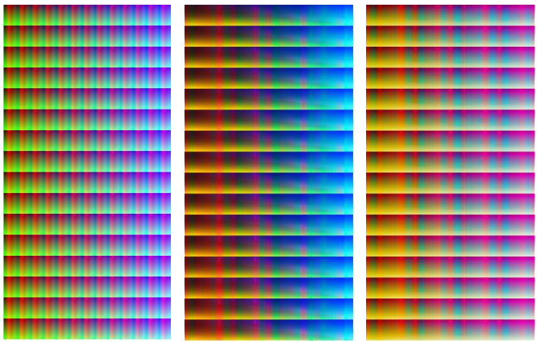

# [NILUT: Conditional Neural Implicit 3D Lookup Tables for Image Enhancement](https://arxiv.org/abs/2306.11920)

[](https://arxiv.org/abs/2306.11920)
[<a href="https://colab.research.google.com/drive/1lvhM-QZd2Lc1B3xohHuwJxicHWCrwdws?usp=sharing"></a>](https://colab.research.google.com/drive/1lvhM-QZd2Lc1B3xohHuwJxicHWCrwdws?usp=sharing)

[Marcos V. Conde](https://scholar.google.com/citations?user=NtB1kjYAAAAJ&hl=en), [Javier Vazquez-Corral](https://scholar.google.com/citations?user=gjnuPMoAAAAJ&hl=en), [Michael S. Brown](https://scholar.google.com/citations?hl=en&user=Gv1QGSMAAAAJ), [Radu Timofte](https://scholar.google.com/citations?user=u3MwH5kAAAAJ&hl=en)


**TL;DR** NILUT uses neural representations for controllable photorealistic image enhancement. 🚀 [Demo Tutorial](nilut-multiblend.ipynb) and pretrained models available. Try it on [colab](https://colab.research.google.com/drive/1lvhM-QZd2Lc1B3xohHuwJxicHWCrwdws?usp=sharing)!


 

----

**3D lookup tables (3D LUTs)** are a key component for image enhancement. Modern image signal processors (ISPs) have dedicated support for these as part of the camera rendering pipeline. Cameras typically provide multiple options for picture styles, where each style is usually obtained by applying a unique handcrafted 3D LUT.

In this work, we propose a Neural Implicit LUT (NILUT), an implicitly defined continuous 3D color transformation parameterized by a neural network. We show that NILUTs are capable of accurately emulating real 3D LUTs. Moreover, a NILUT can be extended to incorporate multiple styles into a single network with the ability to blend styles implicitly. Our novel approach is **memory-efficient, controllable** and can complement previous methods, including **learned ISPs**.


✏️ **Topics** Image Enhancement, Image Editing, Color Manipulation, Tone Mapping, Presets

⚠️ ***Website and repo in progress.*** **See also [AISP](https://github.com/mv-lab/AISP)** for image signal processing code and papers.

----

**Pre-trained models** sample models are available at `models/`. We provide `nilutx3style.pt` a NILUT that encodes three 3D LUT styles (1,3,4) with high accuracy. Download the model [here](https://github.com/mv-lab/nilut/blob/main/models/nilutx3style.pt).

**Demo Tutorial** in [nilut-multiblend.ipynb](nilut-multiblend.ipynb) we provide a simple tutorial on how to use NILUT for multi-style image enhancement and blending. You can run it directly on [colab](https://colab.research.google.com/drive/1lvhM-QZd2Lc1B3xohHuwJxicHWCrwdws?usp=sharing) in a few minutes. The corresponding training code will be released soon.

**Simple Training** check [nilut.ipynb](nilut.ipynb) to see how to fit professional 3D LUT into a NILUT.

**Dataset** The complete folder `dataset/` includes 100 images from the Adobe MIT 5K Dataset. The images were processed using professional 3D LUTs on Adobe Lightroom. For demo purposes, we include dataset in [releases](https://github.com/mv-lab/nilut/releases/), you can [download it here](https://github.com/mv-lab/nilut/releases/download/v0/dataset.zip). The structure of the dataset is:

```
dataset/
├── 001_blend.png
├── 001_LUT01.png
├── 001_LUT02.png
├── 001_LUT03.png
├── 001_LUT04.png
├── 001_LUT05.png
├── 001_LUT08.png
├── 001_LUT10.png
└── 001.png
...
```

where `001.png` is the input unprocessed image, `001_LUTXX.png` is the result of applying each corresponding LUT and `001_blend.png` is the example target for evaluating sytle-blending (in the example the blending is between styles 1,3, and 4 with equal weights 0.33). 
The complete dataset includes 100 images `aaa.png` and their enhanced variants for each 3D LUT.


### How do we learn?

The complete E2E tutorial example on how to fit a NILUT is at [nilut.ipynb](nilut.ipynb)

 

We use **Hald** images, a graphical representation of a 3D LUT in the form of a color table that contains all of the color gradations of the 3D LUT. Considering the input RGB space Hald, and the resultant one after applying a 3D LUT, we can use such pairs for training our models. You can read the details in our paper Section 4. 

For example, we can represent the RGB color space (i.e. all the possible intensities) considering 256^3 = 16.78M points. This set of points can be represented as an image of dimension `4096×4096×3` (below, left). We can sample less points and build the hald image of the RGB space smaller --- see `dataset/halds/Original_Image.png`.

**These images are available (together with the 3D LUT file) in our dataset.**

 

You can read more about this here: https://3dlutcreator.com/3d-lut-creator---materials-and-luts.html

<a href="https://www.youtube.com/watch?v=3ZpbUOGDWLE&t"></a>

### Why is this interesting?

- Depending on the complexity of the real 3D LUT and the NILUT architecture, we can perform the fitting in a few minutes! The model emulates with high-precision the behavious of real 3D LUTs.

- NILUTs are by definition differentiable functions, you can plug&play with it, for example to enhance learned ISPs

- NILUTS are very compact in comparison to complete 3D LUTs (even considering sampling and interpolation).

- NILUTs are a novel application of implicit neural representations for color manipulation! In particular the multi-style encoding and implicit blending of styles.

 

----

Hope you like it 🤗 If you find this interesting/insightful/inspirational or you use it, do not forget to acknowledge our work:

```
@article{conde2023nilut,
  title={NILUT: Conditional Neural Implicit 3D Lookup Tables for Image Enhancement},
  author={Conde, Marcos V and Vazquez-Corral, Javier and Brown, Michael S and Timofte, Radu},
  journal={arXiv preprint arXiv:2306.11920},
  year={2023}
}
```

**Contact** marcos.conde[at]uni-wuerzburg.de

