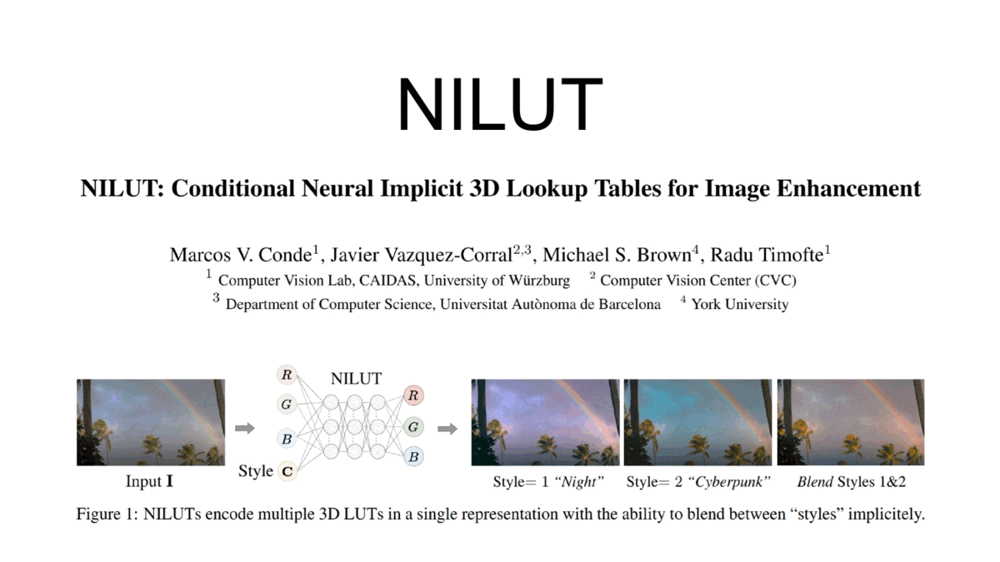
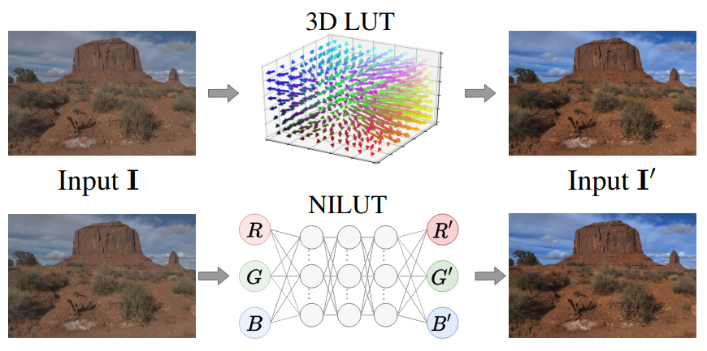
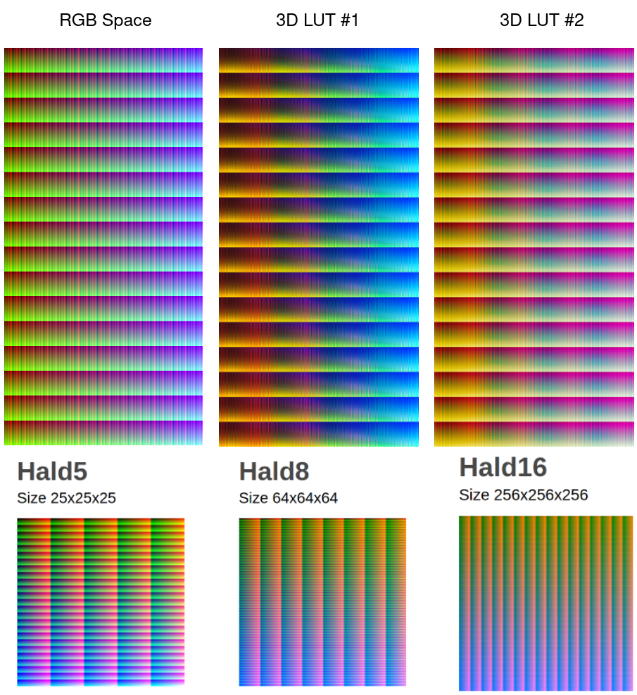
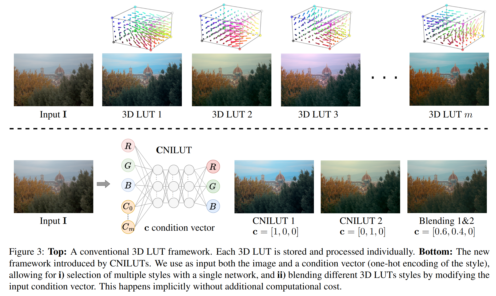

# NILUT @ AAAI 2024
## [NILUT: Conditional Neural Implicit 3D Lookup Tables for Image Enhancement](https://arxiv.org/abs/2306.11920)
### The 38th Annual AAAI Conference on Artificial Intelligence (AAAI), 2024, Vancouver

[](https://arxiv.org/abs/2306.11920)
[<a href="https://colab.research.google.com/drive/1lvhM-QZd2Lc1B3xohHuwJxicHWCrwdws?usp=sharing"></a>](https://colab.research.google.com/drive/1lvhM-QZd2Lc1B3xohHuwJxicHWCrwdws?usp=sharing)
[](https://www.kaggle.com/datasets/photolab/nilut-3d-lut-dataset)
[](https://www.kaggle.com/datasets/photolab/nilut-3d-lut-dataset)
[](https://twitter.com/_akhaliq/status/1678804195229433861?s=20)
[](https://huggingface.co/papers/2306.11920)

[Marcos V. Conde](https://scholar.google.com/citations?user=NtB1kjYAAAAJ&hl=en), [Javier Vazquez-Corral](https://scholar.google.com/citations?user=gjnuPMoAAAAJ&hl=en), [Michael S. Brown](https://scholar.google.com/citations?hl=en&user=Gv1QGSMAAAAJ), [Radu Timofte](https://scholar.google.com/citations?user=u3MwH5kAAAAJ&hl=en)


**TL;DR** NILUT uses neural representations for controllable photorealistic image enhancement. 🚀 [Demo Tutorial](nilut-multiblend.ipynb) and pretrained models available. Try it on [colab](https://colab.research.google.com/drive/1lvhM-QZd2Lc1B3xohHuwJxicHWCrwdws?usp=sharing)!


 

----

**3D lookup tables (3D LUTs)** are a key component for image enhancement. Modern image signal processors (ISPs) have dedicated support for these as part of the camera rendering pipeline. Cameras typically provide multiple options for picture styles, where each style is usually obtained by applying a handcrafted 3D LUT.

We propose a **Neural Implicit LUT (NILUT)**, an implicitly defined continuous 3D color transformation parameterized by a neural network. We show that NILUTs are capable of accurately emulating real 3D LUTs. Moreover, a NILUT can be extended to incorporate multiple styles into a single network with the ability to blend styles implicitly. Our approach is **memory-efficient, controllable** and can complement previous methods, including **learned ISPs**.


✏️ **Topics** Image Enhancement, Image Editing, Color Manipulation, Tone Mapping, Presets

⚠️ ***Website and repo in progress.*** **See also [AISP](https://github.com/mv-lab/AISP)** for image signal processing code and papers.

----

### Steps to fit a simple 3D LUT

1. Get a 3D LUT as a `.cube` file. We provide a sample 3D LUT in `dataset/cube-files`.
2. Generate a Hald image. You can check the script `hald.py` and run it with `python hald.py`. You can also [download here](https://3dlutcreator.com/downloads/materials/Hald/HALD_256.png) a simple hald. This will be our input image I.
3. Load the 3D LUT using the specific software (e.g. Lightroom) and apply it to the hald. This will be our "enahnced" target image I' that reflects the 3D LUT style.
4. You can now [fit.py](fit.py) the 3D LUT transformation using the hald as I and the modified hald as I'.

```
python fit.py --in dataset/halds/Original_Image.png --target dataset/halds/LUT01_ContrastLUT.png --steps 1000 --units 128 --layers 2
```
In **less than 30s** you have it! Now your complex 3D LUT is just `3dlut.pt`, is compact and differentiable, ready to use and plug&play in image processing/enhancement pipelines. **You can run this instantly after forking this repo.** See below more details and explanations.

----

**Pre-trained models** sample models are available at `models/`. We provide `nilutx3style.pt` a NILUT that encodes three 3D LUT styles (1,3,4) with high accuracy. Download the model [here](https://github.com/mv-lab/nilut/blob/main/models/nilutx3style.pt).

**Demo Tutorial** in [nilut-multiblend.ipynb](nilut-multiblend.ipynb) we provide a simple tutorial on how to use NILUT for multi-style image enhancement and blending. You can run it directly on [colab](https://colab.research.google.com/drive/1lvhM-QZd2Lc1B3xohHuwJxicHWCrwdws?usp=sharing) in a few minutes. The corresponding training code will be released soon.

**Simple Training** check [nilut.ipynb](nilut.ipynb) to see how to fit professional 3D LUT into a NILUT.

**Dataset** Download the complete dataset (13 Gb) from [kaggle here](https://www.kaggle.com/datasets/photolab/nilut-3d-lut-dataset). The complete folder `MIT5K-100-3DLUT/` includes 100 images from the Adobe MIT 5K Dataset. The images were processed using professional 3D LUTs on Adobe Lightroom. For demo purposes, we include a sample dataset in [releases](https://github.com/mv-lab/nilut/releases/), you can [download it here](https://github.com/mv-lab/nilut/releases/download/v0/dataset.zip). The structure of this dataset is:

```
dataset/
├── 001_blend.png
├── 001_LUT01.png
├── 001_LUT02.png
├── 001_LUT03.png
├── 001_LUT04.png
├── 001_LUT05.png
├── 001_LUT08.png
├── 001_LUT10.png
└── 001.png
...
```

where `001.png` is the input unprocessed image, `001_LUTXX.png` is the result of applying each corresponding LUT and `001_blend.png` is the example target for evaluating sytle-blending (in the example the blending is between styles 1,3, and 4 with equal weights 0.33). 
The [complete dataset](https://www.kaggle.com/datasets/photolab/nilut-3d-lut-dataset) includes 100 images (e.g. `001.png`) and their enhanced variants for each 3D LUT (e.g. `001_LUT01.png`).


### How do we learn?

The complete E2E tutorial example on how to fit a NILUT is at [nilut.ipynb](nilut.ipynb)

 

We use **Hald** images, a graphical representation of a 3D LUT in the form of a color table that contains all of the color gradations of the 3D LUT. Considering the input RGB space Hald, and the resultant one after applying a 3D LUT, we can use such pairs for training our models. You can read the details in our paper Section 4. 

For example, we can represent the RGB color space (i.e. all the possible intensities) considering 256^3 = 16.78M points. This set of points can be represented as an image of dimension `4096×4096×3` (below, left). We can sample less points and build the hald image of the RGB space smaller --- see `dataset/halds/Original_Image.png`.

**These images are available (together with the 3D LUT file) in our dataset.** [Download here](https://3dlutcreator.com/downloads/materials/Hald/HALD_256.png) a simple hald.

 

You can read more about this here: https://3dlutcreator.com/3d-lut-creator---materials-and-luts.html

<a href="https://www.youtube.com/watch?v=3ZpbUOGDWLE&t"></a>

### Why is this interesting?

- Depending on the complexity of the real 3D LUT and the NILUT architecture, we can perform the fitting in a few minutes! The model emulates with high-precision the behavious of real 3D LUTs.

- NILUTs are by definition differentiable, you can plug&play with it, for example to enhance learned ISPs

- NILUTS are very compact in comparison to complete 3D LUTs (even considering sampling and interpolation).

- NILUTs are a novel application of implicit neural representations for color manipulation! In particular the multi-style encoding and implicit blending of styles.

 


### Frequent questions

> where is the full dataset? 

We host the dataset on Kaggle, you can [download it here](https://www.kaggle.com/datasets/photolab/nilut-3d-lut-dataset) (13 Gb). The dataset includes 100 images (e.g. `001.png`) and their enhanced variants for each 3D LUT (e.g. `001_LUT01.png`).

You can download a demo dataset to test out the model fitting and pre-trained models. The 3D LUTs (`.cube`) are released under CC 4.0 license. The images are from [Adobe MIT5K dataset](https://data.csail.mit.edu/graphics/fivek/) and therefore keeps the original license.

> how the style interpolation works?

First of all, is a cool feature, we are working on it, and more work in that direction is coming :) 
The implicit style blending is similar to the interpolation in other implicit neural representations (INRs) -- pixel interpolation in 2D INRs such as SIREN, novel view synthesis in 3D with NeRF. **The more training points, the better the interpolation function is**. In our example [nilut-multiblend.ipynb](nilut-multiblend.ipynb) we provide a CNILUT with encoded 3D LUT styles and trained on the blending basis `[0.33, 0.33, 0.33]` (i.e. equal contribution of each style). To achieve "any" blending, more training points are required to learn the manifold of styles, for example `[0.5, 0.5, 0]` `[0.5, 0, 0.5]` `[0, 0.5, 0.5]` etc.
Training can take time, but once it is trained, a simple MLP encodes multiple 3D LUTs and can accurately blend them, moreover, since the model is constrained to pixel-wise transformations, no artifacts are introduced.


----

Hope you like it 🤗 If you find this interesting/insightful/inspirational or you use it, do not forget to acknowledge our work:

```
@inproceedings{conde2024nilut,
  title={NILUT: Conditional Neural Implicit 3D Lookup Tables for Image Enhancement},
  author={Conde, Marcos V and Vazquez-Corral, Javier and Brown, Michael S and Timofte, Radu},
  booktitle={Proceedings of the AAAI Conference on Artificial Intelligence},
  year={2024}
}
```

**Contact** marcos.conde[at]uni-wuerzburg.de

